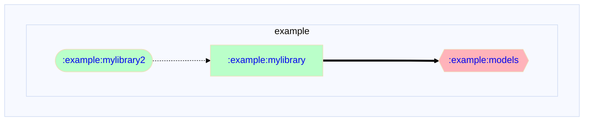

```mermaid
%%{ init: { 'theme': 'base' } }%%
graph LR;

%% Styling for module nodes by type
classDef rootNode stroke-width:4px;
classDef mppNode fill:#ffd2b3,color:#333333;
classDef andNode fill:#baffc9,color:#333333;
classDef javaNode fill:#ffb3ba,color:#333333;

%% Modules
subgraph  
  direction LR;

  subgraph example
    direction LR;
    :example:models{{<a href='https://github.com/anelkad/Gradle-dependency-graphs/blob/main/example/models/dependencyGraph.md' style='text-decoration:auto'>:example:models</a>}}:::javaNode;
    :example:mylibrary[<a href='https://github.com/anelkad/Gradle-dependency-graphs/blob/main/example/mylibrary/dependencyGraph.md' style='text-decoration:auto'>:example:mylibrary</a>]:::andNode;
    :example:mylibrary2([<a href='https://github.com/anelkad/Gradle-dependency-graphs/blob/main/example/mylibrary2/dependencyGraph.md' style='text-decoration:auto'>:example:mylibrary2</a>]):::andNode;
  end
end

%% Dependencies
:example:mylibrary===>:example:models

%% Dependents
:example:mylibrary2-.->:example:mylibrary
```